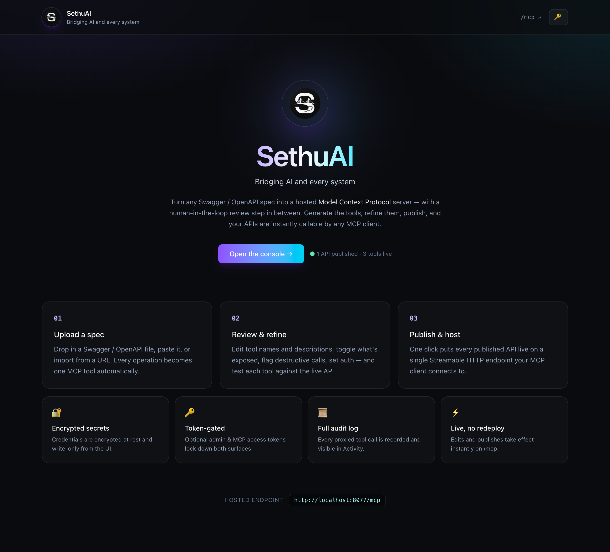
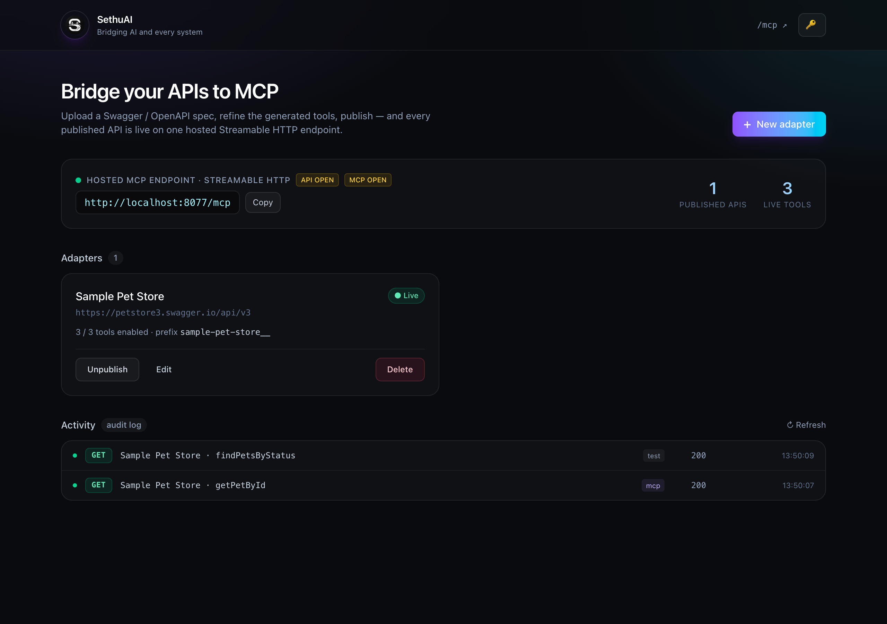
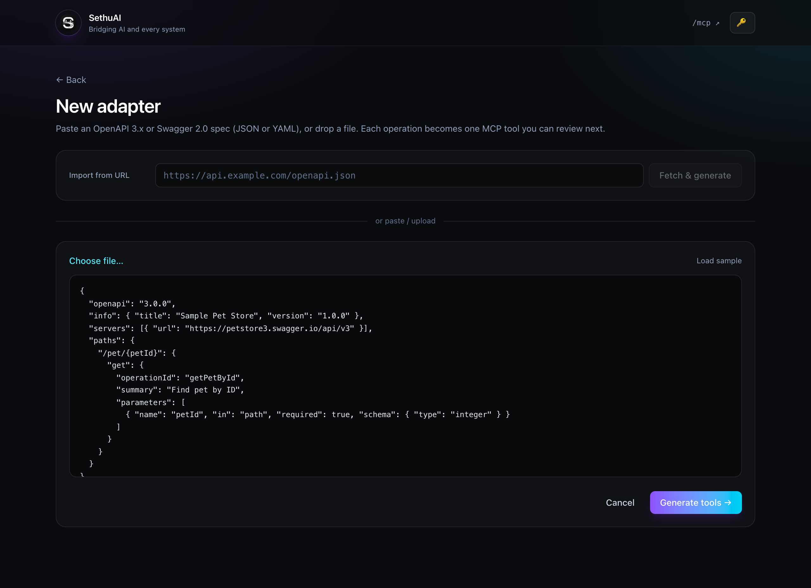
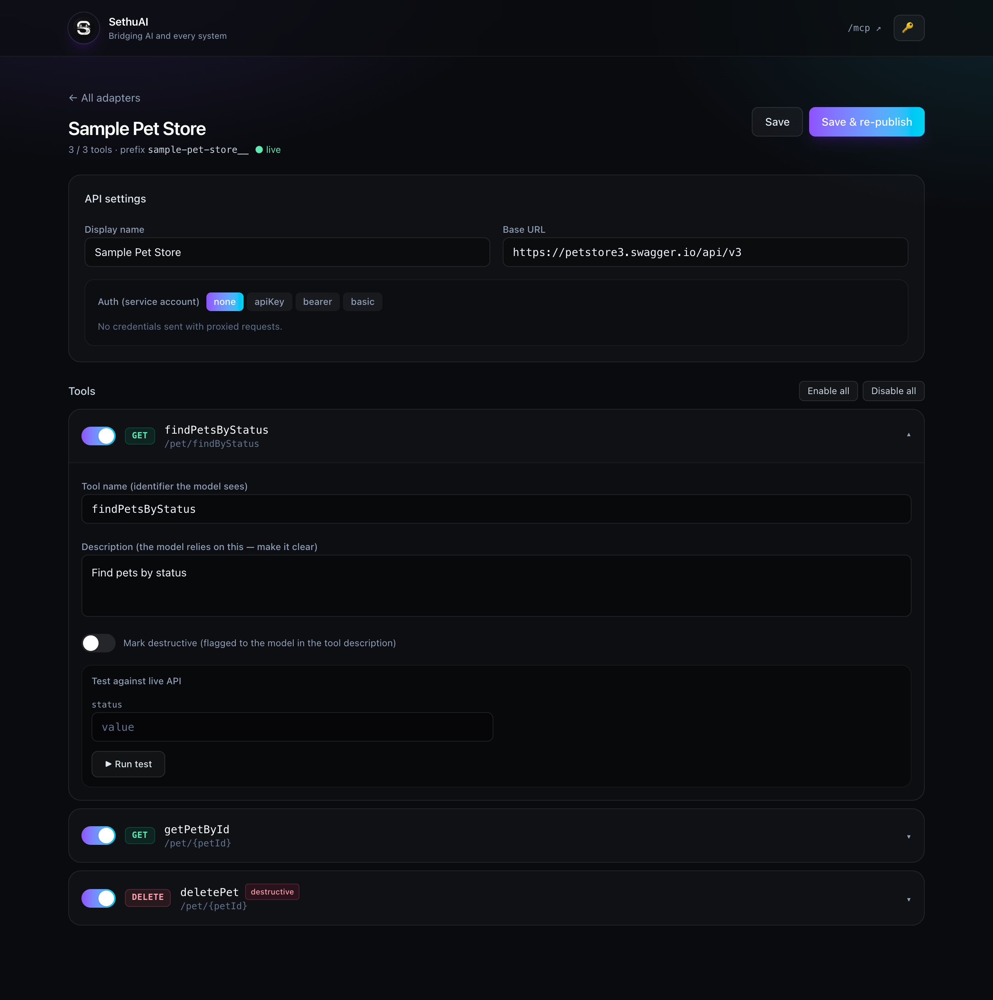

<div align="center">


Turn any **Swagger / OpenAPI** spec into a **hosted MCP server** — with a
human-in-the-loop review step in between.

[](https://github.com/seelamraviteja/SethuAI/actions/workflows/ci.yml)
[](LICENSE)




</div>

---

## What it is

**Sethu** (సేతువు — "bridge") generates a Model Context Protocol (MCP) adapter from
an OpenAPI spec, lets a human refine it in a UI, then hosts it on a single
**Streamable HTTP** endpoint that any MCP client (Claude Desktop, Claude Code,
your own agent) can connect to.

```
 Swagger/OpenAPI ──▶  Generate tools  ──▶  Review & edit (UI)  ──▶  Publish
   (file/paste/URL)                                                   │
                                              ┌───────────────────────┘
                                              ▼
                              GET/POST/DELETE  http://host/mcp   (Streamable HTTP)
                                              │
                                   tool call ─┴─▶ proxied HTTP request to the backend API
```

Every operation in the spec becomes one MCP **tool**: `operationId` → tool name,
parameters + request body → JSON-Schema `inputSchema`, summary → description. The
generator produces a **catalog (data, not code)**, and one runtime serves all
published catalogs live — so edits and publishes take effect instantly.

---

## Requirements

- [`uv`](https://docs.astral.sh/uv/) — manages a Python **3.12** venv (your system Python is untouched)
- **Node 18+** — for the UI build

## Install & run

```bash
git clone <your-repo-url> SethuAI && cd SethuAI
./run.sh                       # builds the UI, then serves UI + API + MCP on :8077
```

Open **<http://localhost:8077>**. That's it.

> **Dev mode (hot reload):** `./dev.sh` runs the backend on `:8077` with reload and
> the Vite dev server on `:5173` (open `5173`, it proxies `/api` and `/mcp`).

---

## HOWTO — from spec to hosted MCP in 4 steps

### 1. Open the console

The landing page introduces SethuAI and shows the live endpoint. Click
**“Open the console →”** to reach your adapters dashboard.



The dashboard shows your **hosted MCP endpoint** (one URL for everything), live
stats, your adapters, and an **Activity** feed of recent tool calls. The badges
next to the endpoint (`API` / `MCP`) show whether each surface is token-protected.

### 2. Create an adapter

Click **“+ New adapter”**, then provide a spec one of three ways — **import from a
URL**, **upload a file**, or **paste** JSON/YAML. (Use **Load sample** to try it
instantly.) Click **“Generate tools →”**.



### 3. Review & refine (human-in-the-loop)

This is the important step. You get one tool per operation; now make them good for
an LLM:

- Edit each **tool name** and **description** (the model relies heavily on these).
- **Toggle** tools on/off individually, or **Enable all / Disable all**.
- **Mark destructive** operations (flagged to the model in the tool description).
- Configure **service-account auth** (None / API key / Bearer / Basic) — secrets
  are encrypted at rest and write-only.
- **Test any tool against the live API** right from the form.



### 4. Publish & host

Hit **Publish** (or **Save & re-publish**). The adapter goes **live immediately**
on `/mcp` — no redeploy. Unpublish any time to take it offline.

---

## Connect your MCP client

The endpoint is `http://localhost:8077/mcp` (Streamable HTTP).

**Claude Code:**
```bash
claude mcp add --transport http sethu http://localhost:8077/mcp \
  --header "Authorization: Bearer $SETHU_MCP_TOKEN"   # omit the header in open mode
```

**Verify with a real MCP client round-trip** (included):
```bash
cd backend && uv run python client_test.py
```

### One endpoint, many APIs

Publishing more adapters does **not** create new URLs — they all live on the same
`/mcp`. Tools stay distinct via a per-adapter slug prefix:

```
http://host/mcp
 ├─ sample-pet-store__getPetById
 ├─ sample-pet-store__deletePet
 └─ weather-api__getForecast      ← another adapter, same endpoint
```

---

## Securing it (production)

All three are opt-in via environment variables. Unset = open dev mode (logged loudly at startup).

```bash
export SETHU_SECRET_KEY="<long random string>"   # encryption key for secrets at rest
export SETHU_ADMIN_TOKEN="<random>"              # required to use the management API / UI
export SETHU_MCP_TOKEN="<random>"                # required for MCP clients to connect
./run.sh
```

- In the UI, click the **🔑** icon and paste the admin token (stored in the browser,
  sent as a Bearer token on management requests).
- MCP clients must send `Authorization: Bearer $SETHU_MCP_TOKEN`.
- If `SETHU_SECRET_KEY` is unset, a key is generated and persisted to
  `backend/data/.sethu_key` for dev convenience — **set it explicitly in production.**

**Enterprise features built in:** 🔐 encrypted secrets at rest · 🔑 token-gated API
& MCP surfaces · 📜 full audit log of every proxied call (shown in **Activity**) ·
🛡️ SSRF protection on outbound calls.

### All configuration

Every knob is an environment variable; sensible defaults mean you usually set none.

| Variable | Default | What it does |
|----------|---------|--------------|
| `SETHU_SECRET_KEY` | generated | Encryption key for secrets at rest |
| `SETHU_ADMIN_TOKEN` | _(open)_ | Gates the management API / UI |
| `SETHU_MCP_TOKEN` | _(open)_ | Gates the hosted MCP endpoint |
| `SETHU_BLOCK_PRIVATE_HOSTS` | on when `SETHU_MCP_TOKEN` is set | Refuse proxied calls to private/loopback/link-local IPs (SSRF guard). Set `1`/`0` to force |
| `SETHU_HTTP_TIMEOUT` | `30` | Default per-request timeout (s) for proxied calls; override per tool in the editor |
| `SETHU_MAX_RESPONSE_CHARS` | `50000` | Cap on response size returned to the model (JSON arrays truncate by item) |
| `SETHU_AUDIT_MAX_BYTES` | `5000000` | Size at which `audit.log` rotates to `audit.log.1` |

> **SSRF note:** in open dev mode the guard is **off** so local backends
> (`localhost`, `127.0.0.1`) stay testable. It turns on automatically once
> `SETHU_MCP_TOKEN` is set — i.e. a production posture.

## Docker

```bash
docker build -t sethuai .
docker run -p 8077:8077 \
  -e SETHU_SECRET_KEY=... -e SETHU_ADMIN_TOKEN=... -e SETHU_MCP_TOKEN=... \
  -v "$PWD/data:/app/backend/data" sethuai
```

---

## Architecture

| Path | What |
|------|------|
| `/`        | React + Vite + Tailwind UI |
| `/api/*`   | FastAPI management API (parse, CRUD, publish, test, audit) — admin-token gated |
| `/mcp`     | Hosted MCP Streamable HTTP endpoint (low-level `mcp` server) — MCP-token gated |

```
backend/app/
  generator.py     OpenAPI -> Catalog (tools)
  mcp_runtime.py   low-level MCP server + HTTP proxy + audit (the /mcp endpoint)
  api.py           management REST API (admin-token gated)
  storage.py       JSON persistence + mtime cache (secrets encrypted at rest)
  crypto.py        Fernet encrypt/decrypt for secrets
  audit.py         append-only JSONL audit log (size-rotated)
  security.py      admin / MCP token checks (constant-time compare)
  net.py           SSRF guard for outbound proxied calls
  config.py        env-driven settings (timeouts, limits, SSRF toggle)
  models.py        pydantic models
  main.py          FastAPI app wiring UI + API + MCP
backend/tests/     pytest suite (generator, net, storage, crypto, runtime, security)
frontend/src/      React + Vite + Tailwind UI (assets/ holds the SethuAI logos)
run.sh / dev.sh    launchers · Dockerfile · docs/ (screenshots) · .github/ (CI)
```

## Limitations (honest)

- **Service-account auth only** (one credential per API, shared by all callers).
  No per-user OAuth token passthrough yet.
- **No rate limiting / RBAC / multi-tenant isolation** yet — the audit choke point
  (`mcp_runtime.invoke`) and token layer are the natural places to add them.
- **Response shaping is basic** — JSON arrays truncate by item (staying valid
  JSON), everything else is a char cut; no per-tool field selection yet.
- **Not representable as tools:** webhooks/callbacks, binary uploads, server-push
  streaming. Complex `oneOf`/`anyOf` schemas pass through as-is.
- **Best for small APIs (<30 endpoints).** Larger specs need tool grouping / dynamic
  tool-search (LLM tool selection degrades past a few dozen tools).
